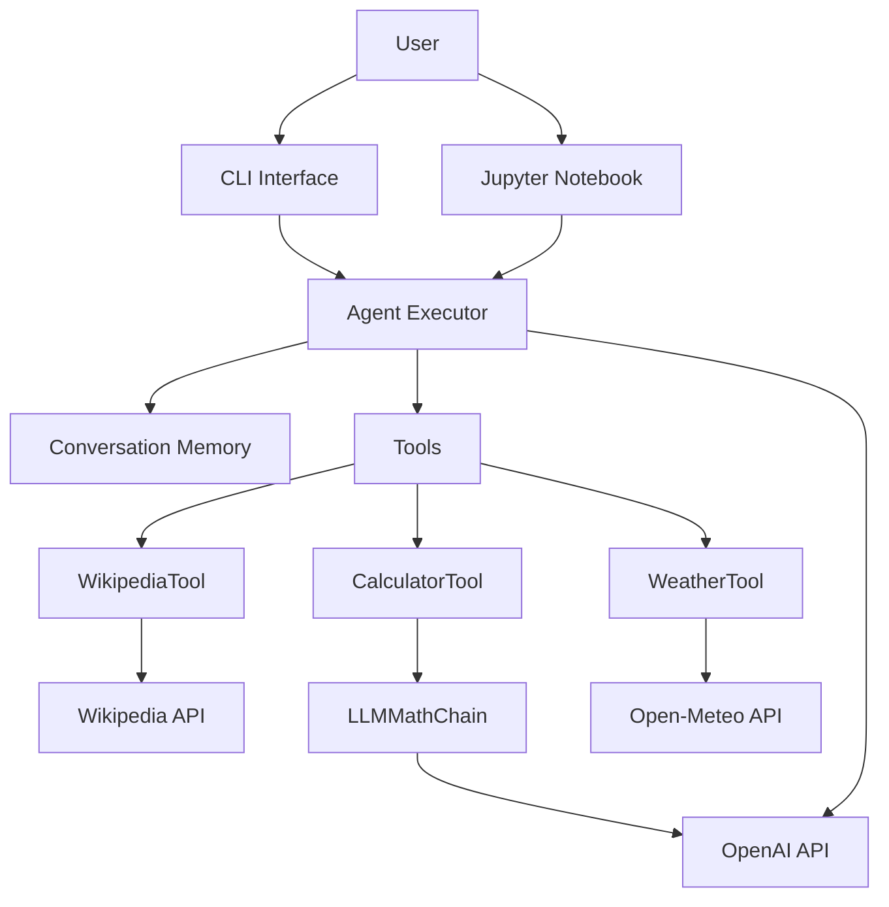

# Research Assistant Agent

A lightweight agent that can autonomously decide which external tools to call (Wikipedia lookup, calculator, live weather) to answer multi-step user questions.


## Features

- **Tool Registry**:
  - `WikipediaTool`: Fetch summary and infobox data via the Wikipedia Python library
  - `CalculatorTool`: Perform numerical evaluations using LangChain's LLMMathChain
  - `WeatherTool`: Get current weather conditions via Open-Meteo REST API (no API key required)

- **Agent Core**:
  - LangChain's Zero-Shot-ReAct-Description strategy
  - Powered by OpenAI GPT-4o (with fallback to GPT-3.5-turbo)
  - Conversation memory for follow-up questions

- **CLI and Notebook Interfaces**:
  - Interactive command-line interface
  - Jupyter notebook with example queries and detailed output

## Architecture

### Project Structure

```
research-assistant/
├── agent/              # Agent implementation
├── tools/              # Tool implementations
├── tests/              # Unit tests
├── notebooks/          # Jupyter notebooks
├── main.py             # CLI entry point
├── requirements.txt    # Dependencies
└── .env.example        # Environment variables template
```

### Component Diagram



## Quick Start

### 1. Clone the repository

```bash
git clone https://github.com/yourusername/research-assistant.git
cd research-assistant
```

### 2. Set up environment

```bash
# Create and activate a virtual environment (optional but recommended)
python -m venv venv
source venv/bin/activate  # On Windows: venv\Scripts\activate

# Install dependencies
pip install -r requirements.txt

# Create .env file from template and add your OpenAI API key
cp .env.example .env
# Edit .env with your favorite editor and add your OpenAI API key
```

### 3. Run the CLI

```bash
python main.py
```

Or run with a specific query:

```bash
python main.py --query "What was France's 2020 population squared?"
```

### 4. Run the Streamlit Web Interface

```bash
streamlit run app.py
```

This will start a web server and open the interface in your browser.

### 5. Run the Jupyter notebook

```bash
jupyter notebook notebooks/demo.ipynb
```

### 6. Run the evaluation script

```bash
python evaluate.py
```

### 7. Using Docker

You can also run the application using Docker:

```bash
# Build and run with docker-compose
docker-compose up

# Or build and run with Docker directly
docker build -t research-assistant .
docker run -it --env-file .env research-assistant
```

## Example Usage

Here's an example of the agent answering a multi-step query:

```
Question: Distance from NYC to Paris in miles divided by 3

Thought: I need to find the distance from New York City to Paris and then divide it by 3. Let me first look up this information.
Action: WikipediaTool
Action Input: Distance from New York City to Paris
Observation: Title: Great-circle distance

Summary: In navigation, the great-circle distance, orthodromic distance, or spherical distance is the shortest distance between two points on the surface of a sphere, measured along the surface of the sphere (as opposed to a straight line through the sphere's interior). The distance between two points in Euclidean space is the length of a straight line between them, but on the sphere there are no straight lines. In spaces with curvature, straight lines are replaced by geodesics. Geodesics on the sphere are circles on the sphere whose centers coincide with the center of the sphere, and are called great circles.
Through any two points on a sphere that are not antipodal points (i.e., not on opposite ends of a diameter), there is a unique great circle. The two points separate the great circle into two arcs. The length of the shorter arc is the great-circle distance between the points.
Between two antipodal points, there are infinitely many great circles, and all great-circle arcs between antipodal points have a length of half the circumference of the circle, or πr, where r is the radius of the sphere.
The Earth is approximately spherical (see Earth radius), so the equations for great-circle distance are important for finding the shortest distance between points on the surface of the Earth, and so have important applications in navigation.

URL: https://en.wikipedia.org/wiki/Great-circle_distance

Thought: I didn't get the specific distance between NYC and Paris. Let me try a more specific search.
Action: WikipediaTool
Action Input: Flight distance New York City to Paris
Observation: Title: Flight distance from New York to Paris

Summary: The flight distance from New York to Paris is 3,625 miles or 5,834 kilometers.

The flight time from New York to Paris is approximately 7 hours and 20 minutes. This assumes an average flight speed for a commercial airliner of 500 mph, which is equivalent to 805 km/h or 434 knots. It also adds an extra 30 minutes for take-off and landing.

URL: https://www.distance.to/New-York/Paris

Thought: Now I have the distance from New York City to Paris, which is 3,625 miles. I need to divide this by 3.
Action: CalculatorTool
Action Input: 3625 / 3
Observation: 3625 / 3 = 1208.3333333333333

Thought: I now know the final answer
Final Answer: The distance from NYC to Paris is 3,625 miles. When divided by 3, the result is approximately 1,208.33 miles.

Time taken: 5.67 seconds
```

## Running Tests

```bash
pytest -v
```

## License

This project is licensed under the MIT License - see the LICENSE file for details.

## Acknowledgements

- [LangChain](https://github.com/langchain-ai/langchain) for the agent framework
- [OpenAI](https://openai.com/) for the language models
- [Open-Meteo](https://open-meteo.com/) for the free weather API 