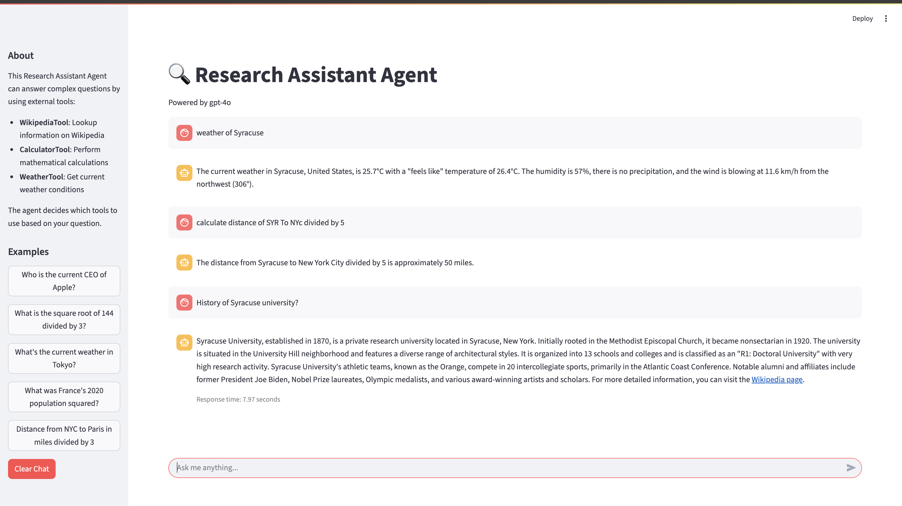

# Research Assistant Agent 🔍

An intelligent agent that can answer complex questions by using multiple tools and reasoning capabilities.

## Interface Screenshot



The Streamlit web interface provides:
- Real-time responses using multiple tools (Wikipedia, Calculator, Weather)
- Step-by-step reasoning process
- Example queries and clear responses
- Response timing information

## Features

- 🌐 **Multiple Tools**: 
  - Wikipedia lookups for information
  - Mathematical calculations
  - Real-time weather data
- 🧠 **Intelligent Reasoning**: Uses LangChain's ReAct framework for step-by-step thinking
- 💬 **Conversation Memory**: Maintains context across multiple queries
- 🖥️ **Multiple Interfaces**:
  - Web interface (Streamlit)
  - Command-line interface
  - Jupyter notebook support

## Installation

1. Clone the repository:
```bash
git clone https://github.com/yourusername/research-assistant.git
cd research-assistant
```

2. Create a virtual environment:
```bash
python -m venv research-assistant-venv
source research-assistant-venv/bin/activate  # On Windows: .\research-assistant-venv\Scripts\activate
```

3. Install dependencies:
```bash
pip install -r requirements.txt
```

4. Set up environment variables:
```bash
cp .env.example .env
# Edit .env with your API keys
```

## Usage

### Web Interface

Run the Streamlit app:
```bash
streamlit run app.py
```

### Command Line

Run from terminal:
```bash
python main.py "Your question here"
```

### Jupyter Notebook

See `notebooks/demo.ipynb` for interactive examples.

## Tools

1. **WikipediaTool**: 
   - Lookup information on Wikipedia
   - Get summaries and key facts

2. **CalculatorTool**: 
   - Perform mathematical calculations
   - Handle complex expressions

3. **WeatherTool**: 
   - Get current weather conditions
   - Support for global locations

## Architecture

The agent uses LangChain's ReAct framework to:
1. Analyze queries
2. Choose appropriate tools
3. Execute actions
4. Synthesize responses

## Development

### Running Tests

```bash
pytest tests/
```

### Docker Support

Build and run with Docker:
```bash
docker-compose up --build
```

## License

This project is licensed under the MIT License - see the [LICENSE](LICENSE) file for details. 